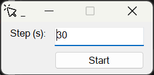

# SimpleAutoClicker

A simple, portable auto clicker for Windows built using AutoHotkey. This application clicks the left mouse button at the current cursor position at specified intervals. The GUI allows users to set the interval and start/stop the clicking action. No additional dependencies or drivers are required.

## How to Use

1. Download the `AutoClicker.exe` file from [here](https://github.com/Daniil-Horobets/SimpleAutoClicker/releases).
2. Run the executable (no installation required).
3. Enter the interval in seconds (e.g., `1` for one second) in the GUI.
4. Click the **Start** button to begin auto-clicking. 
5. Move your cursor to the area you want to click.
6. Click the **Stop** button to stop the auto-clicker.

### ⚠️ Note: You will face the "Windows protected your PC" screen because the `.exe` file is not signed with a certificate. Click `More info` → `Run anyway` or follow the steps below to compile the script yourself.

## How to Compile the Script Yourself

To compile the script into a portable `.exe` file:

1. Install [AutoHotkey](https://www.autohotkey.com/).
2. Clone or download this repository.
3. Right-click on the `AutoClicker.ahk` file and select **Compile Script (GUI)...**
4. Specify path to icon (`assets/mouse_click_icon.ico`)

   This will generate `AutoClicker.exe` with the specified icon.

## License

This project is licensed under the MIT License.

## Acknowledgments

- AutoHotkey for a powerful and easy-to-use scripting language.
- The mouse click icon used in this project is by [imam buke](https://icon-icons.com/users/RLvD9WqySEndKw3AhTGTX/icon-sets/) from [Icon-Icons](https://icon-icons.com), licensed under [CC BY 4.0](https://creativecommons.org/licenses/by/4.0/). No changes made.

